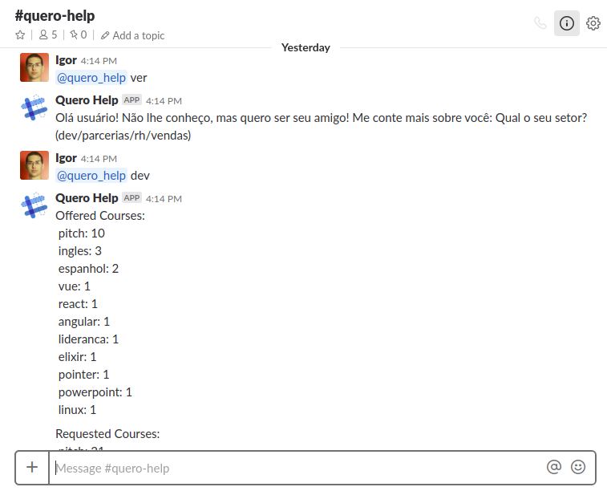
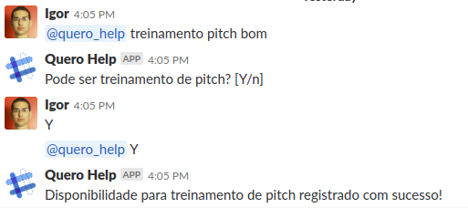
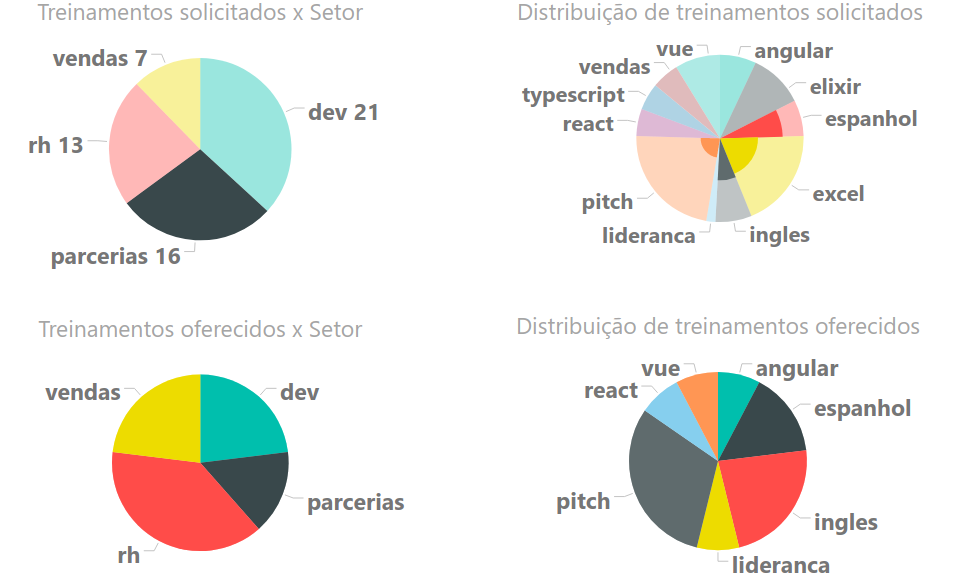

## @quero_Help - slackbot developed along Code in Quero Hackathon 2018

Use "@quero_help treinamento course-example" to request course-example class  
Use "@quero_help treinar course-example" to offer course-example class  
Use "@quero_help ver" to see offered and requested courses  
Use "@quero_help remover course-example" to remove offered course  
Use "@quero_help help" to see available commands  

Offered and requested courses are stored in PostgreSQL database and connected through Microsoft Power BI dashboard via a RESTful API.  

### Some Examples

#### The data dashboard

